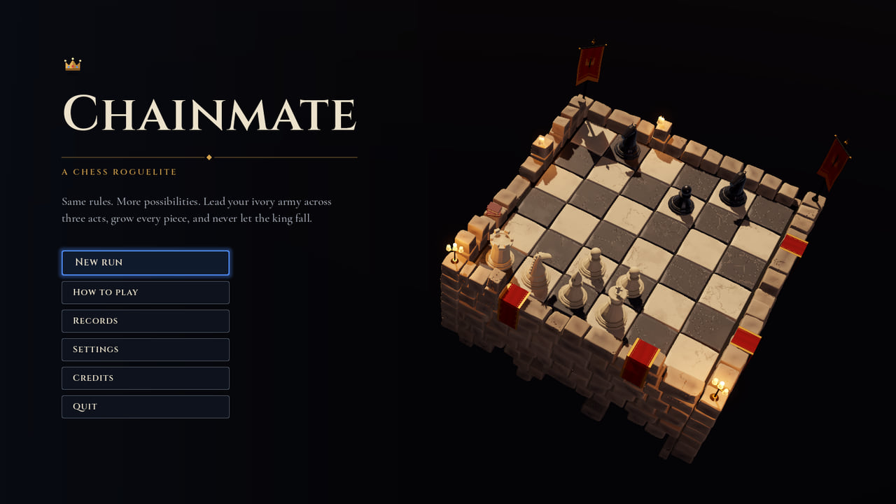
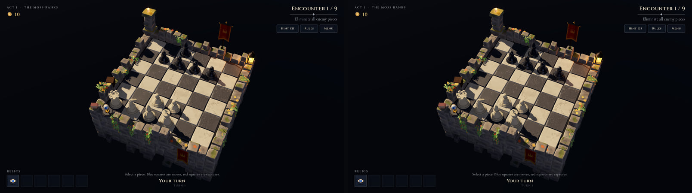
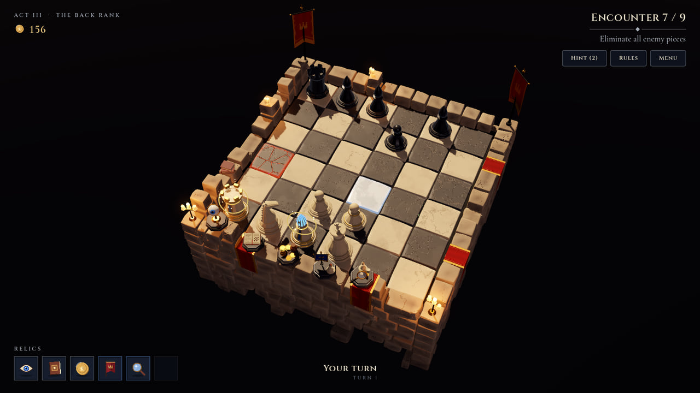
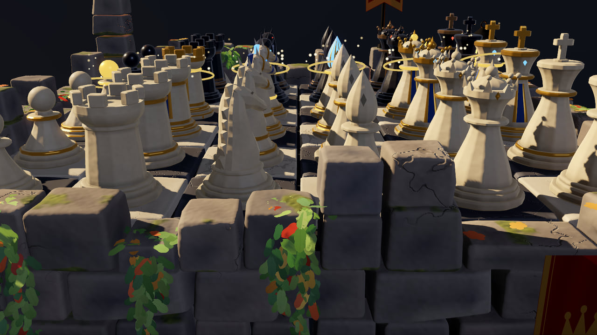
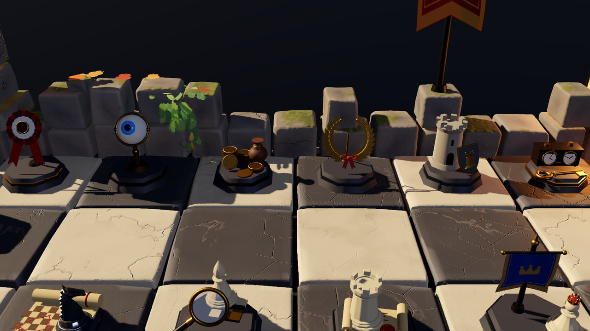
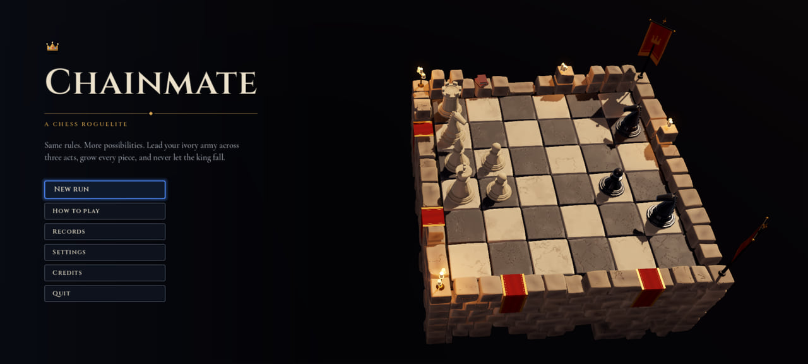

<div align="center">

# Chainmate

**Un roguelite de ajedrez en 3D, portado de su `.exe` de Godot 4.7.2 a JavaScript y three.js,
y comparado contra el original píxel por píxel, muestra por muestra, número por número.**

JavaScript · three.js · WebGL2 · WebAssembly · AudioWorklet · Android



</div>

La meta no fue «un remake que se parezca» sino **el mismo juego**: las mismas partidas con la misma
semilla, los mismos cuadros, la misma interfaz y el mismo sonido. Y cada una de esas afirmaciones
está medida contra el ejecutable original, no a ojo.

```
 el original (Godot 4.7.2, Forward+, Vulkan)                   este port (WebGL2, three.js 0.186)
 ──────────────────────────────────────────                    ──────────────────────────────────
 lógica del juego en GDScript   ──── bit a bit ────▶           src/core          (partidas 1:1)
 SceneTree, corutinas, azar     ──── bit a bit ────▶           src/godot         (orden del cuadro, PCG32)
 TextServerAdvanced + glifos    ──── bit a bit ────▶           src/godot/text    (FreeType + HarfBuzz → wasm)
 renderer Forward+              ──── ≤ 0,02/255 ───▶           src/godot/render  (pase por pase)
 partículas en GPU              ──── ≤ 2·10⁻⁶ ─────▶           src/godot/particles.js (en la CPU)
 audio_synth.gd + mezclador     ──── bit a bit ────▶           src/audio         (AudioWorklet)
```

---

## Qué hice

**1 · Un solo archivo.** Todo empezó con `Chainmate.exe`: 110 MB, Godot 4.7.2, sin el proyecto al
lado. GDRE Tools recuperó lo que el ejecutable llevaba adentro (53 scripts, 57 recursos, escenas,
shaders y fuentes), que quedó en `_original/` como referencia de lectura.

**2 · La regla: nada a ojo.** Leer el código no alcanza para saber qué hace el motor con él. Así
que el mismo `.exe`, parcheado con un solo gancho, se convirtió en un **oráculo**: le paso un
script GDScript (`_oracle/probe_*.gd`), lo corre adentro del motor de verdad y contesta en JSON.
Hay más de veinte sondas: la partida completa paso a paso, cada malla, cada glifo, cada muestra de
audio, el orden de cada `_process` y cada `await`, las etapas intermedias del render, el azar,
las partículas leídas de vuelta de la GPU. Los 258 tests del port se comparan contra esas respuestas.

**3 · Capa por capa, hasta que coincida:**

- **La lógica** (reglas de ajedrez, IA, mapa, encuentros, reliquias, mejoras, eventos): cinco
  partidas enteras reproducidas acción por acción, con el estado completo del generador PCG
  después de cada paso. Idénticas.
- **El motor, en lo que el juego usa**: el orden exacto del cuadro del `SceneTree`, los `await` de
  GDScript como generadores, PCG32 y `hash()`, la matemática de vectores en `float` de 32 bits
  (que decide ramas como `size.x > size.z * 1.55` al armar la arena), `str(float)`, `sort_custom`.
- **El texto**: FreeType 2.14.3 y HarfBuzz 14.2.0, las mismas versiones que trae Godot, compilados
  a WebAssembly con el clang de Zig. Más de 28 000 glifos idénticos bit a bit.
- **El render**: Forward+ desarmado pase por pase (sombras en cascada, SSAO, SSIL, niebla
  volumétrica, dispersión subsuperficial, cielo, glow, tonemapping), cada efecto comparado solo,
  contra los buffers intermedios del original. 88 imágenes por corrida.
- **El sonido**: los 24 efectos y la música, sintetizados como lo hace `audio_synth.gd`, muestra
  por muestra, y el mezclador del motor (buses, limitador) corriendo en un AudioWorklet.
- **La interfaz**: `Control`, contenedores, temas, y el modelo de entrada de Godot 4.7 (qué queda
  bajo el mouse, el foco oculto de un clic, la navegación con teclado).
- **Las partículas**: el compute shader de `GPUParticles3D` corre en la CPU, en precisión simple,
  en el mismo orden. Hasta el divisor de la GPU de referencia tuvo que copiarse: ahí `a / b` es
  `a × rcp(b)` con 169 recíprocos que no redondean como deberían, y eso decide qué chispa renace
  en un borde de paso.

**4 · Las capturas.** El original trae su propio piloto automático, que juega un recorrido y se saca
fotos. Lo volví determinista (cada cuadro dura 1/60 s, el azar global arranca de una semilla y
el teclado y el mouse del escritorio no le llegan) y el port corre exactamente el mismo piloto.
Cada foto se compara con la del original.

**5 · El detective.** Cuando una foto no coincide, una **traza de estado** dice por qué antes de
mirar píxeles: los dos programas imprimen las mismas líneas (cada valor sacado del azar global,
qué control queda bajo el mouse y con qué rectángulo, el foco, los halos en cada foto) y
`tools/trace-compare.mjs` ubica cada valor aleatorio en la **palabra exacta** del generador de la
que salió. Así apareció, por ejemplo, que el `randf()` global de GDScript usa **una** palabra del
generador y el `randf()` de un `RandomNumberGenerator` usa **dos**: esa diferencia desfasaba las
banderas, las velas, el balanceo de cada pieza y las chispas de los halos. Corregida, casi todas las
fotos pasaron de «muy cerca» a «coinciden».

**6 · Android.** Un envoltorio de Capacitor lo lleva al teléfono: apaisado, pantalla completa, la
pantalla no se apaga, el botón Atrás hace lo que Escape en la PC y Salir cierra la app. En el
teléfono se elige solo el renderer Mobile, como hace Godot.

<div align="center">



<sub>A la izquierda, el `.exe` original. A la derecha, el port en el navegador. Misma jugada, mismo cuadro.</sub>

</div>

---

## Resultados

Diferencia media absoluta sobre 255 y porcentaje de píxeles que se apartan más de 8 niveles. Una foto
**coincide** si se aparta menos del 0,05 % de los píxeles, y está **muy cerca** si se aparta menos
del 1 %:

| Qué | Resultado |
|---|---|
| Recorrido completo, 3 actos, 39 fotos | 34 coinciden y 4 muy cerca (peor media 0,03, peor porcentaje 0,12 %); 14/14 chequeos del piloto. Una distinta: el mercader (ver abajo) |
| Menú, arena, piezas y reliquias, 29 fotos | 29/29: 11 coinciden y 18 muy cerca (peor media 0,25: un primer plano del ejército de marfil con halos y chispas) |
| Etapas del render, 6 cámaras | cuadros finales 0,006–0,016; cada efecto solo ≤ 0,12 |
| Lógica | 5/5 partidas idénticas al original, estado por estado |
| Audio | cada muestra idéntica; en un Chrome de verdad (sin sonido), 10/10: callado hasta el primer gesto, la música entra con su fundido, un efecto se oye encima, el bus Master silencia y vuelve |
| Android (emulador API 36) | 7/7: instala, dibuja el menú sobre la arena 3D con el renderer Mobile, no se cae, Atrás y Salir se comportan |
| Tiempo por cuadro, 1600×900, Intel Iris Xe | 39,5 · 44 · 39,5 ms en las tres arenas; el original en la misma máquina: 38,6 · 44,1 · 38,1 ms |

<div align="center">

 

 

</div>

---

## Lo que todavía difiere, y por qué

- **El instante en que una pantalla entra al árbol.** Godot arma una pantalla nueva por etapas (el
  tema le llega a cada control al entrar, `POST_ENTER_TREE` los redimensiona de abajo hacia arriba,
  las etiquetas que parten línea se re-forman con el ancho que tengan en ese momento) y ordena los
  contenedores recién al final del cuadro. El port llega exacto al diseño final, no a ese instante.
  Se nota en una sola foto: en el mercader, un clic sintético que abre la pantalla y suelta en el
  mismo cuadro deja resaltada una carta en el original y no en el port (medido con la traza: el
  panel mide 1236 px antes de ordenarse en el original y 1203 en el port). Con un mouse de verdad,
  el primer movimiento lo corrige.
- **El prepass con multisampling.** WebGL2 no deja leer muestras sueltas: el prepass de
  profundidad y normales que alimenta SSAO y SSIL se dibuja sin MSAA apuntando a la muestra 0 del
  motor (0,07 % de píxeles distintos, en siluetas).
- **Compute shaders.** La niebla volumétrica, SSAO, SSIL y el filtrado del cielo corren como pases
  de fragmentos sobre los mismos buffers (los volúmenes, como atlas de rebanadas filtrados como
  texturas 3D).
- **El sonido arranca con el primer gesto**, como exigen los navegadores.
- **Renderer Mobile.** En el teléfono el port aplica lo que el juego hace fuera de Forward+; no imita
  el aspecto del renderer Mobile de Godot, con el que el original nunca salió.
- **El precalentado de shaders de la versión web** corre en todas las plataformas (WebGL compila al
  primer dibujo), pero por fuera del azar global: el `.exe` de escritorio no lo hace, así que lo que
  sortea se devuelve y cada sorteo posterior queda igual al del original.

---

## Probarlo

```bash
npm install
npm run dev          # http://127.0.0.1:5190   (servidor de desarrollo)
npm run build        # → dist/                 (archivos estáticos, se sirven en cualquier lado)
npm run preview      # http://127.0.0.1:4190   (sirve dist/)
```

Opciones por URL (hacen de los `-- --user-args` de Godot):

| Opción | Qué hace |
|---|---|
| `?capture` | el recorrido de capturas del propio juego; con `menu`, `arena`, `pieces` o `relics`, los recorridos cortos |
| `?seed=TEXTO` | la semilla de la partida del recorrido |
| `?rngseed=N` | el azar global arranca de N en vez del reloj |
| `?fixed=60` | cada cuadro simula exactamente 1/60 s |
| `?renderer=mobile` | el cuadro que ve un teléfono; `forward_plus` fuerza el de escritorio |
| `?ephemeral` | ajustes y partidas guardadas solo en memoria |
| `?app` | se comporta como la versión de escritorio dentro de una pestaña (muestra *Quit*) |
| `?stats` | estadísticas del cuadro en una esquina |
| `?trace` | con `?capture`: la traza de estado del recorrido |

**Android** (Capacitor 6, targetSdk 36):

```bash
cd mobile && npm install && cd ..
node tools/android-assets.mjs       # íconos y splash desde public/icon.svg
node tools/apk.mjs                  # → dist-android/Chainmate-<versión>-debug.apk
node tools/apk.mjs --install --run  # al teléfono conectado (depuración USB)
node tools/apk.mjs --aab            # el bundle firmado que pide Google Play (mobile/android/keystore.properties)
node tools/android-smoke.mjs        # emulador: instala, abre y verifica que dibuje y responda
```

---

## Cómo se verifica

```bash
npm test          # 258 tests, unos 30 s, sin navegador: el port contra las respuestas del oráculo
```

Las respuestas del oráculo (`_oracle/*.json`) están en el repositorio, así que los tests corren en
cualquier clon. Regenerarlas, capturar las fotos del original o correr la traza necesita el
`Chainmate.exe` original:

```bash
npm run oracle -- <sonda>           # corre _oracle/probe_<sonda>.gd adentro del original
npm run capture-original            # las fotos de referencia del original → _ref/
npm run tour                        # el recorrido completo en un Chrome visible → _ref/port/tour/report.html
npm run tour -- arena               # o menu | pieces | relics
npm run stages                      # el render desarmado: 88 imágenes de vistas y efectos sueltos
npm run audio                       # el sonido en un navegador real, medido a la salida
pwsh -File tools/capture-original.ps1 -Modes full -Acts 1 -Trace -RefRoot _ref/trace
npm run tour -- --acts 1 --trace
node tools/trace-compare.mjs --original _ref/trace/logs/full.out.txt --port _ref/port/tour/trace.txt
```

| Suite | Contra el original |
|---|---|
| `runs` | cinco partidas enteras (semillas, ejércitos y dificultades distintas), acción por acción, con el estado del generador |
| `rng`, `gdscript`, `math` | flujos PCG32, `hash()`, estabilidad del orden, formato de números, vectores en float32 |
| `global_random` | `randf()` global (una palabra), `randf_range()` (tres, en doble precisión), `randi_range()` |
| `particles` | los dos sorteos de cada `GPUParticles3D` y 120 cuadros de tres sistemas contra lo que la GPU devolvió (peor 2·10⁻⁶) |
| `gradient_texture` | `GradientTexture2D` byte por byte, en cada modo de relleno y repetición |
| `frame_order` | el orden y el cuadro de cada `_process`, temporizador, tween, llamada diferida y `await` |
| `text`, `glyphs` | métricas de fuentes de 6 a 100 px, shaping glifo por glifo, 28 000+ mapas de bits |
| `meshes`, `relics`, `arena` | cada malla procedural de piezas, reliquias y arena, cada adorno y cada luz |
| `audio` | cada muestra sintetizada (float32 y PCM) y el mezclador de punta a punta |
| `render` | la aritmética del renderer: variantes de shader por pase, el volumen de niebla, los kernels |
| `gui_input` | hover, foco, botones y navegación con teclado como en Godot 4.7 |

---

## Estructura

```
src/
  core/           el juego: reglas, batallas, IA, encuentros, mapa, reliquias, mejoras, eventos, estado
  godot/          las partes del motor que el juego usa, portadas desde las fuentes de 4.7.2
    scene.js        SceneTree: orden del cuadro, temporizadores, llamadas diferidas, entrada
    coroutine.js    los `await` de GDScript como generadores
    rng.js          PCG32, las funciones globales de Math:: y hash(), bit a bit
    particles.js    GPUParticles3D: el compute shader del motor, paso a paso en la CPU
    render/         el cuadro Forward+: materiales, sombras, SSAO/SSIL, niebla volumétrica, SSS, cielo, glow
    text/           FreeType (WebAssembly) + HarfBuzz, atlas de glifos
    ui/             Control, contenedores, widgets, temas, renderer 2D, entrada y foco
  presentation/   las escenas del juego: arena, tablero, piezas, reliquias, cámara, efectos, HUD, pantallas
  audio/          audio_synth.gd y el mezclador del motor (AudioWorklet, síntesis en workers)
  autoload/       Settings, Profile, Sfx
  dev/            sondas del lado del port (etapas del render, traza de estado)
_original/        el proyecto que se recuperó del .exe (solo lectura)
_oracle/          las sondas que corren adentro del original, y lo que contestaron
e2e/              chequeos en el navegador: recorridos, etapas del render, costo del cuadro, audio
tools/            oráculo, comparación de imágenes, cliente CDP, capturas del original, traza, Android
native/ftw/       el puente en C que se compila con FreeType + HarfBuzz a src/godot/text/ftw.wasm
mobile/           el envoltorio de Android (Capacitor 6)
```

`src/godot/text/ftw.wasm` está en el repositorio. Para reconstruirlo:

```bash
python tools/fetch-godot-src.py      # fuentes del motor → _build/godot-src
node tools/build-ftw.mjs             # el clang de Zig → src/godot/text/ftw.wasm
```

---

## Licencias

El juego y el port se publican bajo licencia **MIT** (`LICENSE`). El contenido del juego (scripts,
shaders, textos) viene del Chainmate original, que está en `_original/`. El panel de créditos
lleva cada aviso: Godot Engine (MIT), FreeType (FTL), HarfBuzz (MIT), Cinzel y Cormorant Garamond
(SIL OFL 1.1, `public/fonts`), three.js (MIT), harfbuzzjs (MIT), FastNoiseLite (MIT);
`tools/credits.mjs` junta las bibliotecas del port en `public/credits/port.json`.
